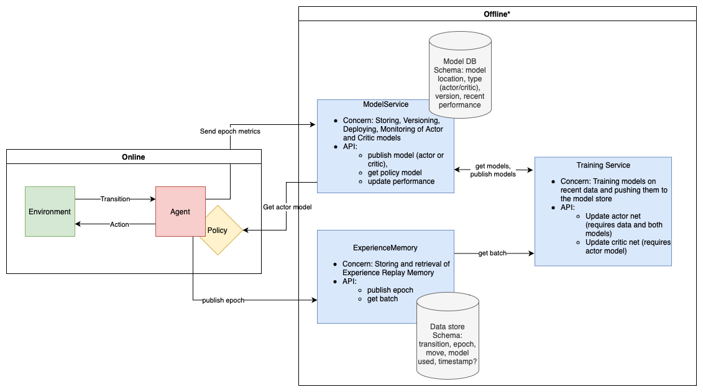

Last year, my partner bought me a robotics kit for playing with RL.  This was right before I started at Amazon Go, so I
quickly became too bogged down with work to do any side projects.  This thing sat and collected dust for months before I
got back into tinkering with it.  By that time, I had experienced firsthand all of the infrastructure that is required
to operate a large scale machine learning product (Amazon Go, that is).  Besides making the robot do funny things, I was
really interested in implementing a service architecture for the full lifecycle of the robot as an ML product.
Furthermore, I wanted this infrastructure to be suitably abstract that it could handle other usecases as well, by
designing a system of interfaces that only need to be implemented and scripted.

So far, I still have not gotten around to training the robot (that will be a separate post), but I have made quite a bit
of progress on the latter problem.

## System Design

I had a few goals and guiding principles for this project.
- The primary goal is to build a system of interfaces for personal RL projects that allows for model- and environment-agnostic high level scripting.
- I wanted to use the same infra code for custom environments (for example, I wrote a
  [tetris game](https://github.com/jonathanlamar/tetris) and
  [snake game](https://github.com/jonathanlamar/snake-learning) when I was bored), OpenAI Gym environments, and robot
  applications.
- I wanted to use the Sutton and Barto notation throughout, so the Gym interface would do the conversion once and all of
  my code would be consistent.
- I wanted to decouple RL and ML methodology as much as possible.  From what I have read, RL uses stuff like neural
  networks, but the theory is not overly concerned with them.  I wanted those low level details to be separate.
- More generally, I wanted to emphasize good design, both from a system perspective, as well as in code (in particular,
  I wanted to use dependency inversion quite heavily with these interfaces.)

With these principles in mind, here is the final design of my RL Infrastructure project.



## Abstraction

On the topic of dependency inversion, I wanted to implement everything as interfaces, rather than abstract classes.
This would allow me to implement a lot of the generic interactions at the abstract level.  For example, using
parameterized types (implemented with the `TypeVar` class in Python), the environment and transition interfaces are
defined like so.

```python
from dataclasses import dataclass
from typing import Protocol, TypeVar


# States will vary quite a bit between implementations, so I am just using this
# class as a type stub.
class State:
    pass


Action = str
S = TypeVar("S", bound=State, covariant=False, contravariant=False)
A = TypeVar("A", bound=Action, covariant=False, contravariant=False)


@dataclass
class Transition(Protocol[S, A]):
    state: S
    action: A
    newState: S
    reward: float
    isTerminal: bool


class Environment(Protocol[S, A]):
    currentState: S

    def step(self, action: A) -> Transition[S, A]:
        raise NotImplementedError

    def getReward(self, oldState: S, action: A, newState: S) -> float:
        raise NotImplementedError
```

Then, for example, the robot states, actions, and transitions can be defined like so:

```python
@dataclass
class RobotState(State, RobotSensorReading):
    image: ndarray
    distanceSweep: ndarray
    motionDetected: bool
    lightColorSensor: ndarray


class RobotAction(Action, Enum):
    MOVE_FORWARD = "MOVE_FORWARD"
    MOVE_BACKWARD = "MOVE_BACKWARD"
    TURN_LEFT = "TURN_LEFT"
    TURN_RIGHT = "TURN_RIGHT"
    DO_NOTHING = "DO_NOTHING"


@dataclass
class RobotTransition(Transition[RobotState, RobotAction]):
    state: RobotState
    action: RobotAction
    newState: RobotState
    reward: float
    isTerminal: bool
```

## Robot Service (Edge Component)

While there is no extra infrastructure required to use this infra code for training models on Gym environments or custom
games, the robot presents a special challenge.  That is that the robot itself runs on a Raspberry Pi 3B+, which is a
very low spec computer.  Moreover, I have installed the "Raspbian for Robots" OS on the Pi because it comes with drivers
preinstalled for the GoPiGo kits, and that OS only has python 3.5 for some reason.

This is all to say that it made more sense to run a small flask app on the raspberry pi which would receive commands
from a client running on my computer, and send sensor data back.  The `RobotEnvironment` class calls this client to send
actions and build transitions to return to the `RobotAgent`.  Thus in this usecase, the online component interacts with
an edge component like so.


## Wrapping Up

I will write a more detailed post about the offline component, since that is more complicated and requires some
knowledge of deep Q-learning (in particular actor-critic methods and experience replay memory).  Once I finally start
training models, I hope to show those off as well.
